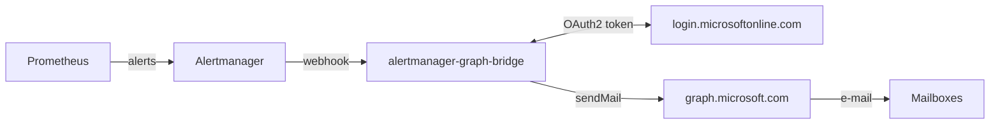

<div align="center">

# alertmanager-graph-bridge

**A lightweight bridge between Prometheus Alertmanager and the Microsoft Graph API**

Receive Alertmanager webhooks, turn them into tidy HTML e-mails, and deliver them through Microsoft 365 with OAuth2 - no SMTP AUTH required.

_Shipped as the `alertmanager-graph-bridge` binary, container image and Helm chart._

[](https://github.com/slauger/alertmanager-graph-bridge/actions/workflows/ci.yaml)
[](https://goreportcard.com/report/github.com/slauger/alertmanager-graph-bridge)
[](go.mod)
[](LICENSE)
[](https://github.com/slauger/alertmanager-graph-bridge/pkgs/container/alertmanager-graph-bridge)

</div>

---

## Features

- 📥 **Alertmanager webhook API** - implements `POST /api/v1/alerts` (schema v4).
- 🔐 **Bearer-token auth** - optional, constant-time comparison, configurable.
- 📧 **Microsoft Graph `sendMail`** - OAuth2 client-credentials flow with automatic token caching and refresh.
- 🎨 **Selectable HTML templates** - a `modern` card-based layout or a `classic` Alertmanager look, chosen with `mail.template`.
- 👥 **Smart recipient routing** - a default recipient list, overridable per alert with the `email_to` label.
- 🩺 **Operability** - `/healthz`, `/readyz` and Prometheus `/metrics` endpoints out of the box.
- ⚙️ **Flexible config** - YAML file and/or `AGB_`-prefixed environment variables.
- 🪶 **Tiny footprint** - a single static Go binary on a rootless UBI-minimal image.

## Architecture



The bridge parses the webhook, groups alerts by recipient set, renders an HTML message per group and sends it through Microsoft Graph. See the [architecture docs](docs/architecture.md) for details.

## Quick Start

Install with Helm from the GitHub Container Registry:

```bash
helm install alertmanager-graph-bridge \
  oci://ghcr.io/slauger/charts/alertmanager-graph-bridge \
  --namespace monitoring --create-namespace \
  --set config.azure.tenantId=<TENANT_ID> \
  --set config.azure.clientId=<CLIENT_ID> \
  --set secret.clientSecret=<CLIENT_SECRET> \
  --set config.mail.from=monitoring@example.com \
  --set 'config.mail.to={ops-team@example.com}'
```

Then point Alertmanager at it:

```yaml
receivers:
  - name: graph-bridge
    webhook_configs:
      - url: http://alertmanager-graph-bridge.monitoring.svc:8080/api/v1/alerts

route:
  receiver: graph-bridge
```

## Configuration

Configuration comes from a YAML file and/or `AGB_`-prefixed environment variables (env wins over file).

```yaml
server:
  port: 8080
  bearerToken: ""        # empty disables authentication
azure:
  tenantId: ""
  clientId: ""
  clientSecret: ""       # prefer AGB_AZURE_CLIENTSECRET
mail:
  from: "monitoring@example.com"
  to:
    - "ops-team@example.com"
  subjectPrefix: "[alertmanager-graph-bridge]"
  template: "modern"     # modern (default) or classic
  saveToSentItems: false
log:
  level: info            # debug, info, warn, error
  format: json           # json or text
```

| Variable | Description |
| --- | --- |
| `AGB_CONFIG` | Path to the YAML config file |
| `AGB_SERVER_PORT` | HTTP listen port |
| `AGB_SERVER_BEARERTOKEN` | Webhook bearer token |
| `AGB_AZURE_TENANTID` / `AGB_AZURE_CLIENTID` / `AGB_AZURE_CLIENTSECRET` | Azure app credentials |
| `AGB_MAIL_FROM` | Sender address |
| `AGB_MAIL_TO` | Default recipients (comma-separated) |
| `AGB_LOG_LEVEL` / `AGB_LOG_FORMAT` | Logging options |

Full reference: [docs/configuration.md](docs/configuration.md).

## Endpoints

| Method | Path | Purpose |
| --- | --- | --- |
| `POST` | `/api/v1/alerts` | Alertmanager webhook receiver |
| `GET` | `/healthz` | Liveness probe |
| `GET` | `/readyz` | Readiness probe |
| `GET` | `/metrics` | Prometheus metrics |

## Metrics

| Metric | Type | Description |
| --- | --- | --- |
| `agb_webhook_requests_total` | counter | Webhook requests by `outcome` |
| `agb_webhook_request_duration_seconds` | histogram | Webhook handling latency |
| `agb_mails_sent_total` | counter | E-mails sent successfully |
| `agb_mail_send_errors_total` | counter | Failed sends by `reason` |
| `agb_mail_send_duration_seconds` | histogram | `sendMail` latency |
| `agb_panics_recovered_total` | counter | Panics recovered by the HTTP middleware |
| `agb_build_info` | gauge | Build and Go version |

## Azure Setup

1. Create an **App registration** in the Microsoft Entra admin center.
2. Add a **client secret**.
3. Grant the **`Mail.Send`** Microsoft Graph **application** permission and click **Grant admin consent**.
4. Use the tenant ID, client ID and secret in the configuration above.

See [docs/getting-started.md](docs/getting-started.md) for the full walkthrough.

## Container Image

Multi-architecture images (`linux/amd64`, `linux/arm64`) are published to:

```
ghcr.io/slauger/alertmanager-graph-bridge
```

The image is a single static binary on `ubi9/ubi-minimal`, running rootless as UID `1001`.

## Helm Chart

The Helm chart lives in [`charts/alertmanager-graph-bridge`](charts/alertmanager-graph-bridge) and is published as an OCI artifact to `ghcr.io/slauger/charts`. It supports `ServiceMonitor` and `Ingress` resources and can reference an existing `Secret` via `existingSecret`.

## Development

```bash
make build    # compile the binary
make test     # run all tests with the race detector
make cover    # run tests and enforce 80% coverage
make lint     # golangci-lint (incl. gosec)
make ci       # run the full check suite
```

The Microsoft Graph and Alertmanager interactions are fully mocked in unit and integration tests, so no Azure tenant is needed. Coverage is kept above 95%. See [docs/development.md](docs/development.md).

## End-to-End Testing (live)

A containerised end-to-end suite additionally exercises the bridge against the **live Microsoft Graph API**. Terraform provisions the Microsoft Entra app registration (`Mail.Send` permission with admin consent), and `make` targets (or a `workflow_dispatch` workflow) run the suite:

```bash
az login                                             # as a tenant admin
cd terraform && terraform init && terraform apply     # create the Azure app
cd .. && cp e2e.env.example e2e.env                   # fill in outputs + mailboxes
make e2e-build && make e2e-run                        # run against live Graph
```

It needs a Microsoft 365 tenant with a licensed mailbox and a tenant-admin account; there is no Azure consumption cost (only Entra objects are created). The suite covers firing/resolved/grouped alerts, recipient fan-out, bearer auth, and the live error paths. Full guide: [docs/e2e-testing.md](docs/e2e-testing.md).

For the **complete chain** - a real Prometheus and Alertmanager in an ephemeral kind cluster driving an alert all the way to a live e-mail - `make cluster-e2e` provisions, deploys, tests and tears everything down with only Docker on the host. Full guide: [docs/cluster-e2e-testing.md](docs/cluster-e2e-testing.md).

## Documentation

| Page | Contents |
| --- | --- |
| [Getting Started](docs/getting-started.md) | Install, Azure app registration |
| [Configuration](docs/configuration.md) | Full YAML + environment reference |
| [Architecture](docs/architecture.md) | Request flow, packages, delivery semantics |
| [API Reference](docs/api-reference.md) | HTTP endpoints and metrics |
| [Development](docs/development.md) | Build, test, project layout |
| [End-to-End Testing](docs/e2e-testing.md) | Live Microsoft Graph testing |
| [Cluster E2E Testing](docs/cluster-e2e-testing.md) | Full chain in a kind cluster |
| [Quality Criteria](docs/quality.md) | The bar every change is held to |

The full site is built with MkDocs and published to GitHub Pages.

## Contributing

See [CONTRIBUTING.md](CONTRIBUTING.md) for the development workflow. Commits follow the [Conventional Commits](https://www.conventionalcommits.org/) specification, and releases and the changelog are generated automatically by semantic-release. The bar every change is held to is documented in the [quality criteria](docs/quality.md); security reports go through [SECURITY.md](SECURITY.md).

## License

Licensed under the [Apache License 2.0](LICENSE).

## Authors

**Simon Lauger** - [@slauger](https://github.com/slauger)

**Bastian Sommerer** - [@bsommerer](https://github.com/bsommerer)
