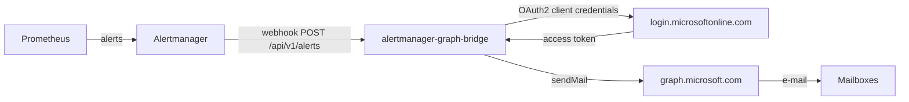

# Architecture

## Overview

## Request flow

1. Alertmanager delivers a webhook (schema version 4) to `POST /api/v1/alerts`.
2. The auth middleware checks the bearer token when one is configured.
3. The payload is decoded into a typed `Payload` / `Alert` structure.
4. Alerts are grouped by their resolved recipient set (the `email_to` label, or
   the configured default recipients).
5. Each group is rendered into an HTML e-mail with `html/template`.
6. The Microsoft Graph client sends each message through `sendMail`, reusing a
   cached OAuth2 token and retrying once on HTTP 429.
7. Metrics are recorded and the appropriate HTTP status is returned to
   Alertmanager (`200` on success, `502` if any send failed).

## Go packages

The code is split into small, independently testable packages:

- `internal/config` - loads and validates configuration (YAML + env).
- `internal/alertmanager` - the webhook payload schema and parser.
- `internal/mail` - recipient grouping and HTML rendering.
- `internal/graph` - the Microsoft Graph client (OAuth2 + `sendMail`).
- `internal/server` - HTTP handlers, auth middleware and metrics.
- `cmd/alertmanager-graph-bridge` - wiring and process lifecycle.

## Token handling

The `golang.org/x/oauth2/clientcredentials` package manages the access token.
A token is fetched on first use, cached in memory and refreshed automatically
once it expires. Tokens are never written to disk.

## Delivery semantics

If any alert group fails to deliver, the handler responds with `502` so that
Alertmanager retries the whole batch. Because Alertmanager keeps re-sending
firing alerts, a transient failure is self-healing; duplicate e-mails are
possible but rare.
